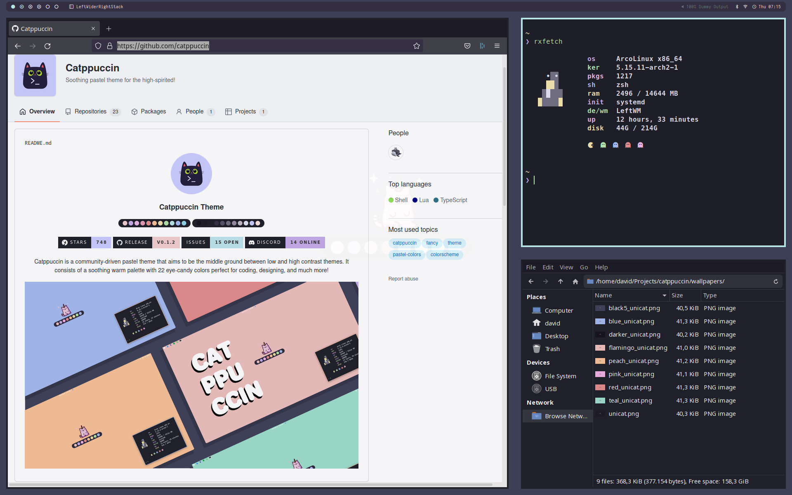
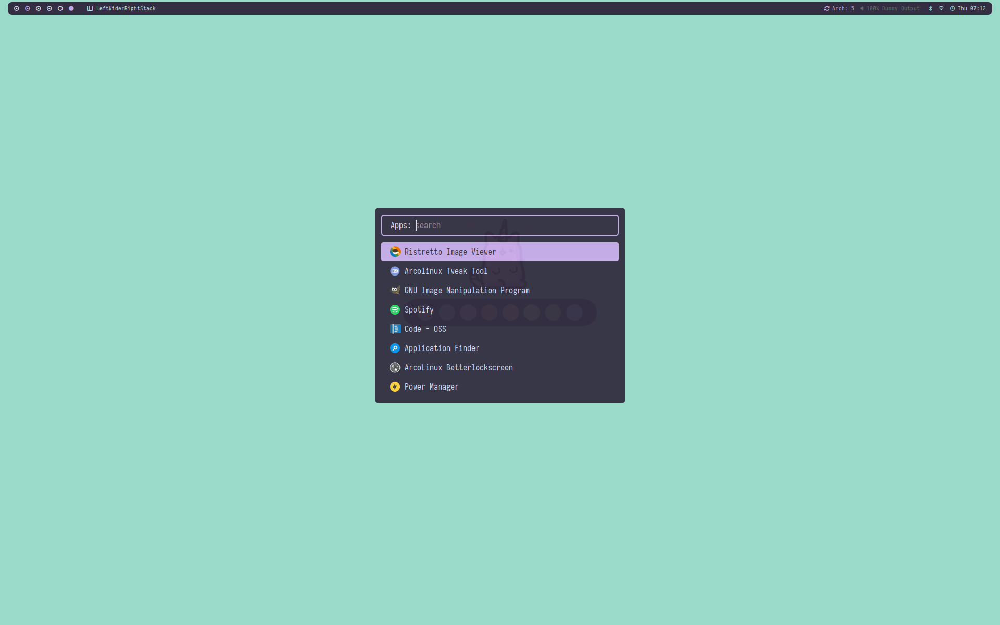
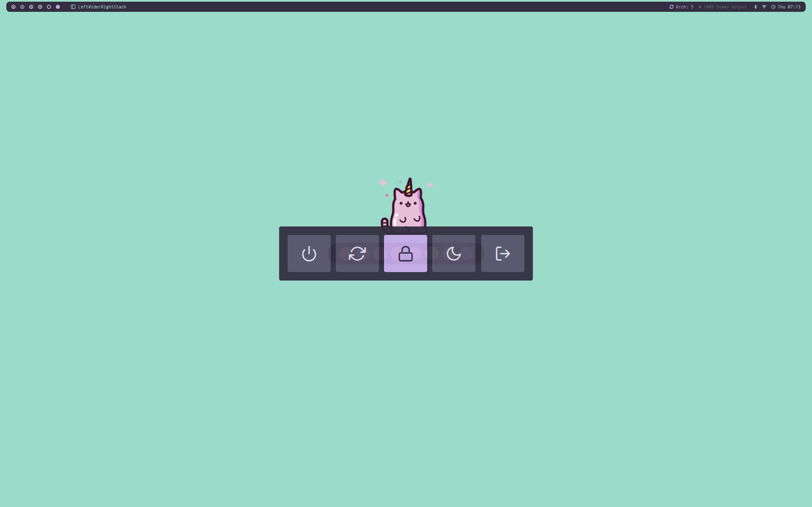
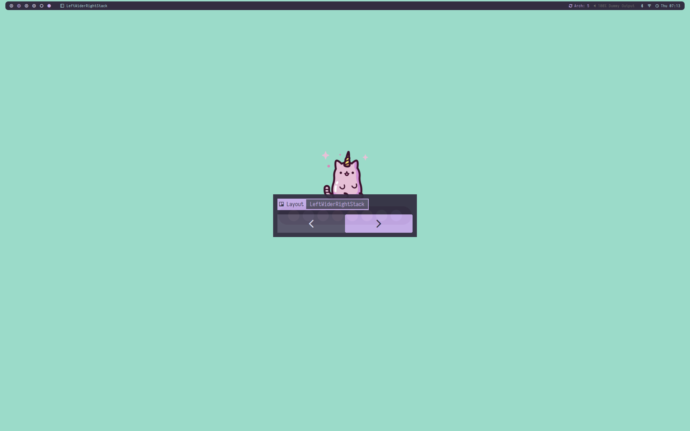

- [Catppuccin](#catppuccin)
- [Screenshots](#screenshots)
- [Dependencies](#dependencies)
- [Installation](#installation)
- [Configuration](#configuration)
  - [Applets](#applets)
  - [Wallpapers](#wallpapers)
  - [Polybar](#polybar)
    - [Pulseaudio Control](#pulseaudio-control)
    - [Systray](#systray)
- [Changelog](#changelog)
  - [v0.1.0](#v010)
  - [To do](#to-do)
- [Credit / Sources](#credit--sources)


# Catppuccin
*A [LeftWM](https://github.com/leftwm/leftwm) minimalistic theme inspired by the adorable [homonymous pastel theme](https://github.com/catppuccin)*


# Screenshots






# Dependencies

- [LeftWM](https://github.com/leftwm/leftwm) - duh

`Fonts`
- Iosevka Nerd Font
- Roboto
- Noto Sans
- FontAwesome

Fee free to install some fonts from the theme root folder
```
./installfonts.sh
```

In general it might be a good idea to install all [nerd fonts](https://www.nerdfonts.com/).

`Run by up script`

- polybar
- feh
- numlockx
- picom     

`Run by polybar (and keybindings)`

- pavucontrol
- nm-connection-editor
- blueberry
- pamac


`Misc`
- alacritty (or change configs to match your terminal emulator)
- dunst / xfce4-notifyd  (adapt *up* script accordingly)
- [papirus-icon-theme](https://github.com/PapirusDevelopmentTeam/papirus-icon-theme)


# Installation
1. Install all required dependencies

2. Clone the repository in ~/.config/leftwm/themes

```BASH
cd ~/.config/leftwm/themes
git clone https://github.com/di-effe/catppuccin.git
```

3. Remove the symlink to your current theme if set

```BASH
rm ~/.config/leftwm/themes/current
```
4. Set this as your current theme

```BASH
ln -s ~/.config/leftwm/themes/catppuccin ~/.config/leftwm/themes/current
```

5. Restart your window manager

```Default shortcut
$MOD + Shift + r
```


# Configuration 

## Applets

This theme doesn´t have a launcher and powermenu modules configured in Polybar, but you can configured a few keybindings to launch some Rofi applets.

For example you could add these to your `config.toml`

```
# Theme applets

# Launcher
[[keybind]]
command = "Execute"
value = "$HOME/.config/leftwm/themes/current/scripts/launcher.sh"
modifier = ["modkey"]
key = "space"

# Powermenu
[[keybind]]
command = "Execute"
value = "$HOME/.config/leftwm/themes/current/scripts/powermenu.sh"
modifier = ["modkey", "Shift"]
key = "p"

# Layout switcher
[[keybind]]
command = "Execute"
value = "$HOME/.config/leftwm/themes/current/scripts/layout.sh"
modifier = ["modkey", "Shift"]
key = "l"
```

Run a `leftwm-check` to ensure you don´t have multiple bindings on the same keys.


## Wallpapers

*up* is configured with the options to
- set random wallpapers from the /wallpapers folder
- set ONE wallpaper for all displays
- set MULTIPLE wallpapers for all displays (default)

Uncomment what you prefer and comment the rest. It should be clear enough reading the file.


## Polybar

### Pulseaudio Control
This is an interesting module you might want to use, just keep in mind it will grab your device description from

```
pactl list sinks | grep device.description
```

and that is usually a very long string.
The pulseaudio-control module in *polybar.modules* has been configured to use fancier nicknames for speakers and headphone, but you have to replace my values with yours.

For speakers (without any wired or bluetooth headphone connected) check
```
pactl list sinks short | cut -f2
```

and use the output here
```
--sink-nickname "VALUE_DETECTED_HERE:蓼 Speakers" 
```

For wired headphones, plug them, check again
```
pactl list sinks short | cut -f2
```

and use the output here
```
--sink-nickname "VALUE_DETECTED_HER: Headphones"
```


### Systray
Systray has beed disabled by default in *polybar.config*
```
tray-position = none
```
If you want to use it change position and adjust the **tray-offset-x** value.


# Changelog

## v0.1.0
- First release


## To do
- [ ] More color schemes from the catppuccin project


# Credit / Sources

- Polybar modules configuration style (plus snippets and scripts) from [Peter Dauwe](https://github.com/PeterDauwe) and [adi1090x](https://github.com/adi1090x/polybar-themes)

- Application launcher is based on the [rofi-themes-collection](https://github.com/lr-tech/rofi-themes-collection) by [LR Tech](https://github.com/lr-tech) covered by a GNU General Public License v3.0

- Powermenu is loosely based on the [rofi-themes](hhttps://github.com/adi1090x/rofi) by [adi1090x](https://github.com/adi1090x) covered by a GNU General Public License v3.0

